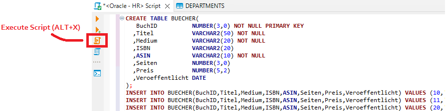

# PL/SQL mit dem Docker Container für Oracle 21 XE

Die Anleitung zur Installation von Docker ist
[im Repo Dbi2Sem](https://github.com/schletz/Dbi2Sem/blob/master/01_OracleVM/03_Docker/README.md)
beschrieben. Wer Docker Desktop schon installiert hat, aber noch keinen Oracle Container hat,
kann mit dem folgenden Befehl den Container erstellen:

```text
docker run -d -p 1521:1521 -e ORACLE_PASSWORD=oracle --name oracle21c gvenzl/oracle-xe:21-full
```

> **Wichtig:** Das erste Starten des Containers erfordert etwas Zeit, da die Datenbank noch
> initialisiert wird. In diesem Zustand ist noch keine Verbindung möglich. Prüfe daher im Log
> des Containers (klicke in Docker Desktop auf den Namen des Containers), ob die Datenbank schon
> fertig initialisiert wurde. Erst dann kannst du die nachfolgenden Schritte ausführen.


## Anlegen der HR Datenbank für PL/SQL

In den PL/SQL Übungen wird eine HR Datenbank verwendet. Um sie anzulegen, führe folgende Schritte
durch: Führe in der Eingabeaufforderung den Befehl `docker exec -it oracle21c bash` aus, um eine Shell
(*bash*) im Conainer *oracle21c* zu öffnen. Kopiere danach die folgenden Befehle und bestätige
den letzten Befehl mit Enter. **Achte davor darauf, ob der Befehl auch erfolgreich ausgeführt
wurde (commit complete Meldung) oder ob ein Fehler in der Konsole angezeigt wird.**

```bash
sqlplus system/oracle@//localhost/XEPDB1 <<< "
    DROP USER hr CASCADE;
    CREATE USER hr IDENTIFIED BY oracle;
    GRANT CONNECT, RESOURCE, CREATE VIEW TO hr;
    GRANT UNLIMITED TABLESPACE TO hr;
" &&
curl https://raw.githubusercontent.com/schletz/Dbi3Sem/master/01_PL_SQL/1_hr_cre.sql | sqlplus hr/oracle@//localhost/XEPDB1 &&
curl https://raw.githubusercontent.com/schletz/Dbi3Sem/master/01_PL_SQL/2_hr_popul.sql | sqlplus hr/oracle@//localhost/XEPDB1
exit
```

Du kannst dich dann in SQL Developer, DBeaver, ... mit folgenden Daten verbinden:

- Username: hr
- Passwort: oracle
- Service Name: XEPDB1
  
Das Schema kommt aus den offiziellen Musterschemata von Oracle. Nähere Infos sind auf
<sub><sup>https://docs.oracle.com/en/database/oracle/oracle-database/21/comsc/installing-sample-schemas.html#GUID-1E645D09-F91F-4BA6-A286-57C5EC66321D</sup></sub>
und auf
<sub><sup>https://docs.oracle.com/en/database/oracle/oracle-database/21/comsc/HR-sample-schema-scripts-and-objects.html#GUID-E275273F-4D1A-4096-A593-0884CA5C961C</sup></sub>
aufrufbar.

Du kannst die verlinkten SQL Skripts auch direkt in SQL Developer oder einem anderen SQL Editor
ausführen. Erstelle aber vorher den User *hr*. Erstelle die Tabellen nicht im User *System*!

## Anlegen eines Users für die Prüfung

Führe in der Shell des Containers den folgenden Befehl aus, um einen User *exam* mit dem Passwort
*oracle* anzulegen. **Achte darauf, ob der Befehl auch erfolgreich ausgeführt
wurde (commit complete Meldung) oder ob ein Fehler in der Konsole angezeigt wird.**

```
sqlplus system/oracle@//localhost/XEPDB1 <<< "
    DROP USER exam CASCADE;
    CREATE USER exam IDENTIFIED BY oracle;
    GRANT CONNECT, RESOURCE, CREATE VIEW TO exam;
    GRANT UNLIMITED TABLESPACE TO exam;
"
```

Soll ein ganzes SQL Skript ausgeführt werden, muss in DBeaver mit *Execute Script* gearbeitet werden.


