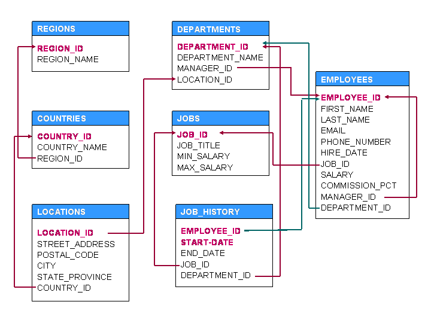
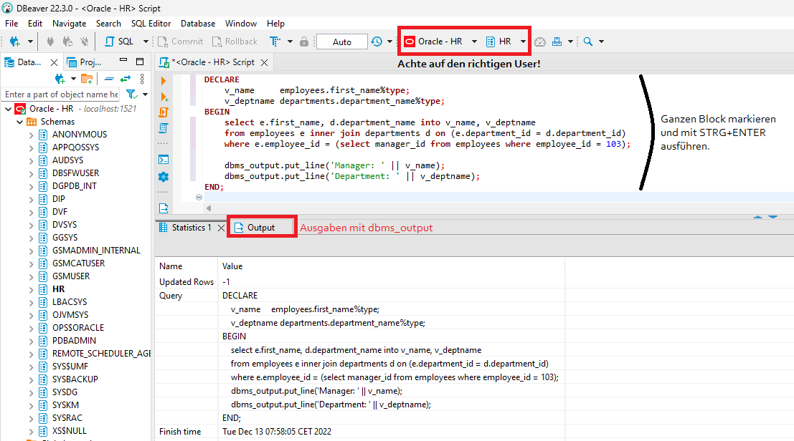
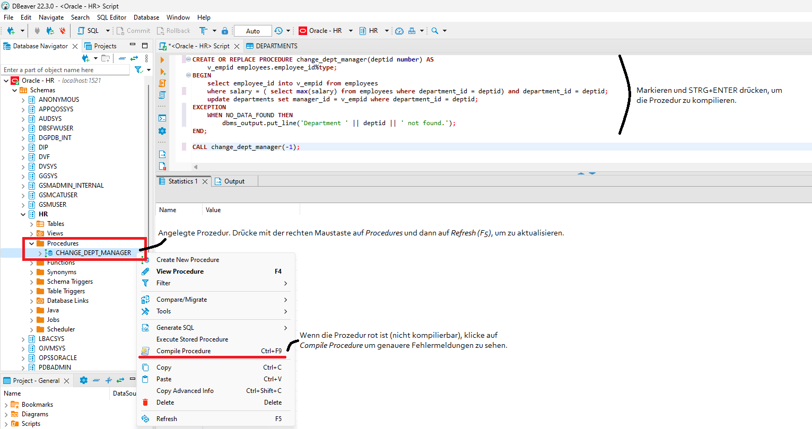

# Übungen zu PL/SQL

Auf [pdfcoffee.com](https://pdfcoffee.com/hr-schema-queries-and-plsql-programs-pdf-free.html)
gibt es ein Übungsblatt mit gelösten Übungen. Diese sind hier abgebildet.



## Einfache Programme

Schreibe die Lösung in einen Block mit dem Aufbau

```sql
DECLARE
    -- your variables
BEGIN
    -- your logic
END;
```

Hinweis: Ausgaben können mit *dbms_output.put_line(value)* erzeugt werden. Du kannst `||` zur
Stringverknüpfung in Oracle verwenden. In DBeaver musst du den ganzen Block markieren, um ihn
auszuführen:



**(1)** Write a program to interchange the salaries of employee 120 and 122.

<details>
<summary>Lösung anzeigen</summary>

```sql
DECLARE
    v_salary_120 employees.salary%type; 
BEGIN
    select salary into v_salary_120
    from employees where employee_id = 120;

    update employees set salary = ( select salary from employees where employee_id = 122) where employee_id = 120;
    update employees set salary = v_salary_120 Where employee_id = 122;
    commit;
END;
```
</details>

**(2)** Increase the salary of employee 115 based on the following conditions: If experience is more
than 10 years, increase salary by 20% If experience is greater than 5 years, increase salary by 10%
Otherwise 5%. Use case when Expressions. Hint: calculate experience with *floor((sysdate-hire_date) / 365)*

<details>
<summary>Lösung anzeigen</summary>

```sql
DECLARE
    v_exp number(2);
    v_hike number(5,2);
BEGIN
    select floor((sysdate-hire_date) / 365) into v_exp from employees
    where employee_id = 115; v_hike := 1.05;
    case
        when v_exp > 10 then v_hike := 1.20;
        when v_exp > 5 then v_hike := 1.10;
    end case;

    update employees set salary = salary * v_hike where employee_id = 115;
END;
```
</details>

**(3)** Change commission percentage as follows for employee with ID = 150. If salary is more than
10000 then commission is 0.4%, if Salary is less than 10000 but experience is more than 10 years then
0.35%, if salary is less than 3000 then commission is 0.25%. In the remaining cases commission is 0.15%.

<details>
<summary>Lösung anzeigen</summary>

```sql
DECLARE
    v_salary employees.salary%type;
    v_exp    number(2);
    v_cp     number(5,2);
BEGIN
    select v_salary, floor ((sysdate-hire_date)/365) into v_salary, v_exp from employees
    where employee_id = 150;

    if v_salary > 10000 then
        v_cp := 0.4;
    elsif v_exp > 10 then
        v_cp := 0.35;
    elsif v_salary < 3000 then
        v_cp := 0.25;
    else
    v_cp := 0.15;
    end if;
    update employees set commission_pct = v_cp where employee_id = 150;
END;
```
</details>

**(4)** Find out the name of the employee and name of the department for the employee who is
managing for employee 103.

**Output:**
```text
Manager: Lex
Department: Executive
```

<details>
<summary>Lösung anzeigen</summary>

```sql
DECLARE
    v_name     employees.first_name%type;
    v_deptname departments.department_name%type;
BEGIN
    select e.first_name, d.department_name into v_name, v_deptname
    from employees e inner join departments d on (e.department_id = d.department_id)
    where e.employee_id = (select manager_id from employees where employee_id = 103);

    dbms_output.put_line('Manager: ' || v_name);
    dbms_output.put_line('Department: ' || v_deptname);
END;
```
</details>

**(5)** Display years where no employees are hired. Hint: Loop from minimum year + 1 to
maximum year - 1. You can extract the year of hiring with *EXTRACT(YEAR FROM hire_date)*. Count
the year and if count is 0, print the year.

**Output:**
```text
1988
1992
```

<details>
<summary>Lösung anzeigen</summary>

```sql
DECLARE
    v_min number(4);
    v_max number(4);
    v_c number(4);
BEGIN
    select min(extract(year from hire_date)), max(extract(year from hire_date)) into v_min, v_max
    from employees;

    for curr_year in v_min + 1 .. v_max - 1 loop
        select count(*) into v_c from employees
        where extract(year from hire_date) = curr_year;

        if v_c = 0 then
            dbms_output.put_line(curr_year);
        end if;
    end loop; 
END;
```
</details>

**(6)** Display the year in which maximum number of employees joined along with how many joined in
each month in that year. Hint: Use *extract(year from hire_date)* or *extract(month from hire_date)*.

**Output:**
```text
year : 1997
month : 1 employees : 3
month : 2 employees : 2
month : 3 employees : 6
month : 4 employees : 1
month : 5 employees : 0
month : 6 employees : 2
month : 7 employees : 2
month : 8 employees : 4
month : 9 employees : 2
month : 10 employees : 3
month : 11 employees : 1
month : 12 employees : 2
```

<details>
<summary>Lösung anzeigen</summary>

```sql
DECLARE
    v_year number(4);
    v_c number(2);
BEGIN
    select extract(year from hire_date) into v_year from employees
    group by extract(year from hire_date)
    having count(*) = (select max(count(*)) from employees group by extract(year from hire_date));
    dbms_output.put_line('year : ' || v_year);

    for month in 1 .. 12 loop
        select count(*) into v_c from employees
        where extract(month from hire_date) = month and extract(year from hire_date) = v_year;
        dbms_output.put_line('month : ' || to_char(month) || ' employees : ' || to_char(v_c));
    end loop;
END;
```
</details>

**(7)** Change salary of employee 130 to the salary of the employee with first name "Joe". If Joe
is not found then take average salary of all employees. If more than one employee with first name 
"Joe" is found then take the least salary of the employees with first name Joe. Hint: Use
*no_data_found* exception.

<details>
<summary>Lösung anzeigen</summary>

```sql
DECLARE
    v_salary employees.salary%type;
BEGIN
    select salary into v_salary
    from employees where first_name = 'Joe';
    
    update employees set salary = v_salary where employee_id = 130;

exception
    when no_data_found then
    update employees set salary = (select avg(salary) from employees) where employee_id = 130;
END;
```
</details>

## Cursor

Schreibe die Lösung in einen Block mit dem Aufbau

```sql
DECLARE
    CURSOR -- your cursor declaration
    -- other declarations
BEGIN
    -- your logic
END;
```

**(8)** Display Job Title and Name of the oldest Employees per Job (*hire_date* is the minimum of
all Employees of the *job_id*)

**Output:**
```text
President: Steven
Administration Vice President: Neena
Administration Assistant: Jennifer
Finance Manager: Nancy
Accountant: Daniel
Accounting Manager: Shelley
Public Accountant: William
Sales Manager: John
Sales Representative: Janette
Purchasing Manager: Den
Purchasing Clerk: Alexander
Stock Manager: Payam
Stock Clerk: Renske
Shipping Clerk: Nandita
Programmer: Alexander
Marketing Manager: Michael
Marketing Representative: Pat
Human Resources Representative: Susan
Public Relations Representative: Hermann
```

<details>
<summary>Lösung anzeigen</summary>

```sql
DECLARE
    cursor jobscur is select job_id, job_title from jobs;
    v_name employees.first_name%type;
BEGIN
    for jobrec in jobscur loop
        select first_name into v_name from employees
        where hire_date = (select min(hire_date) from employees where job_id = jobrec.job_id) 
            and job_id = jobrec.job_id;
        dbms_output.put_line( jobrec.job_title || ': ' || v_name);
    end loop;
END;
```
</details>

**(9)** Display from the 5th to the 10th employee in Employees table. Hint: Use *%rowcount* in your loop.

**Output:**
```text
5 Bruce
6 David
7 Valli
8 Diana
9 Nancy
10 Daniel
```

<details>
<summary>Lösung anzeigen</summary>

```sql
DECLARE
    cursor empcur is select employee_id, first_name from employees;
BEGIN
    for emprec in empcur loop
        exit when empcur%rowcount > 10;
        if empcur%rowcount > 4 then 
            dbms_output.put_line(empcur%rowcount || ' ' || emprec.first_name);
        end if;
    end loop;
END;
```
</details>

**(10)** Update salary of an employee based on department and commission percentage. If department
is 40 increase salary by 10%. If department is 70 then 15%, if *commission_pct* is more than 0.3 then
5% otherwise 10%.

<details>
<summary>Lösung anzeigen</summary>

```sql
DECLARE
    cursor empcur is select employee_id, department_id, commission_pct from employees;
    v_hike number(2);
BEGIN
    for emprec in empcur loop
            if emprec.department_id = 40 then
                v_hike := 10;
            elsif emprec.department_id = 70 then
                v_hike := 15;
            elsif emprec.commission_pct > 0.30 then
                v_hike := 5;
            else
                v_hike := 10;
            end if;

        update employees set salary = salary + salary * v_hike/100
        where employee_id = emprec.employee_id;
    end loop;
END;
```
</details>

## Funktionen und Prozeduren

Schreibe die Lösung in einen Block mit dem folgenden Aufbau:

```sql
-- FUNCTION:
CREATE OR REPLACE FUNCTION my_function(param1 [IN|OUT] datatype1, ...) RETURN returntype AS
    -- your declarations
BEGIN
    -- your logic
    return some_value;
END;

-- PROCEDURE:
CREATE OR REPLACE PROCEDURE my_procedure(param1 [IN|OUT] datatype1, ...) AS
    -- your declarations
BEGIN
    -- your logic
END;
```

Du kannst Funktionen testen, indem du sie mit einem SELECT aufrufst: `SELECT my_function(my_param) FROM DUAL;` 
Bei Prozeduren verwende CALL: `CALL change_dept_manager(100);`  Bachte in DBeaver die folgenden
Schritte zum Anlegen von Funktionen und Prozeduren:



**(11)** Create a function *get_dept_manager_name(deptid)* that takes department ID and returns the
name of the manager of the department.

<details>
<summary>Lösung anzeigen</summary>

```sql
CREATE OR REPLACE FUNCTION get_dept_manager_name(deptid number) RETURN varchar AS
    v_name employees.first_name%type;
BEGIN
    select first_name into v_name from employees
    where employee_id = ( select manager_id from departments where department_id = deptid);
    return v_name;
END;
```
</details>
 
**(12)** Create a function *get_no_of_jobs_done(empid)* that takes employee ID and return the number
of jobs done by the employee in the past.

<details>
<summary>Lösung anzeigen</summary>

```sql
CREATE OR REPLACE FUNCTION get_no_of_jobs_done(empid number) RETURN number AS
    v_count number(2);
BEGIN
    select count(*) into v_count from job_history
    where employee_id = empid;
    return v_count; 
END;
```
</details>

**(13)** Create a procedure *change_dept_manager(deptid)* that takes department ID and changes the
manager ID for the department to the employee in the department with highest salary. (Use Exceptions).

<details>
<summary>Lösung anzeigen</summary>

```sql
CREATE OR REPLACE PROCEDURE change_dept_manager(deptid number) AS
    v_empid employees.employee_id%type;
BEGIN
    select employee_id into v_empid from employees
    where salary = ( select max(salary) from employees where department_id = deptid) and department_id = deptid;
    update departments set manager_id = v_empid where department_id = deptid;
END;
```
</details>

**(14)** Create a function *get_employees_for_manager(manager)* that takes a manager ID and return
the names of employees who works for this manager. The names must be returned as a string with
comma separating names.

<details>
<summary>Lösung anzeigen</summary>

```sql
CREATE OR REPLACE FUNCTION get_employees_for_manager(manager number) RETURN varchar2 AS
    CURSOR empcur is select first_name from employees where manager_id = manager;
    v_employees varchar2(1000) := '';
BEGIN
    for emprec in empcur loop
        v_employees := v_employees || ',' || emprec.first_name;
    end loop;
    return ltrim(v_employees,','); -- ­­remove extra , at the beginning
END;
```
</details>

## Trigger

Schreibe die Lösung in einen Block mit dem folgenden Aufbau:

```sql
CREATE OR REPLACE TRIGGER my_trigger [before|after] [insert|update|delete] [or insert|or delete]
ON tablename FOR EACH ROW
DECLARE -- if you have declarations
    -- your declarations
BEGIN
    -- your statements
END;
```

**(15)** Ensure no changes can be made to EMPLOYEES table before 6am and after 10pm in a day.
Use *to_char(sysdate,'hh24')* to extract the current hour. Raise an exception if there is a change
which is not in this time range:
*raise_application_error(­20111,'Sorry! No change can be made before 6 AM and after 10 PM');*

<details>
<summary>Lösung anzeigen</summary>

```sql
CREATE OR REPLACE TRIGGER trg_employees_time_check before update or insert or delete
ON employees FOR EACH ROW
BEGIN
    if to_char(sysdate,'hh24') < 6 or to_char(sysdate,'hh24') > 10 then
        raise_application_error(­20111,'Sorry! No change can be made before 6 AM and after 10 PM');
    end if;
END;
```
</details>

**(16)** Create a Trigger to ensure the salary of the employee is not decreased. Raise
error 20111 with *Sorry! Salary can not be decreased!* if the new salary is lower than the old salary.

<details>
<summary>Lösung anzeigen</summary>

```sql
CREATE OR REPLACE TRIGGER trg_employees_salary_check before update
ON employees FOR EACH ROW
BEGIN
    if :old.salary > :new.salary then
        raise_application_error(­20111,'Sorry! Salary can not be decreased!');
    end if;
END;
```
</details>

**(17)** Whenever the job is changed for an employee write the following details into job history.
Employee ID, old job ID, old department ID, hire date of the employee for start date, system date
(systate) for end date. But if a row is already present for employee job history then the start date should be
the end date of that row + 1 day.

<details>
<summary>Lösung anzeigen</summary>

```sql
CREATE OR REPLACE TRIGGER trg_log_job_change after update of job_id
ON employees FOR EACH ROW
DECLARE
    v_enddate date;
    v_startdate date;
BEGIN
    select max(end_date) into v_enddate from job_history where employee_id = :old.employee_id;
    if v_enddate is null then
        v_startdate := :old.hire_date;
    else
        v_startdate := v_enddate + 1;
    end if;

    insert into job_history values (:old.employee_id, v_startdate, sysdate, :old.job_id, :old.department_id);
END;
```
</details>

