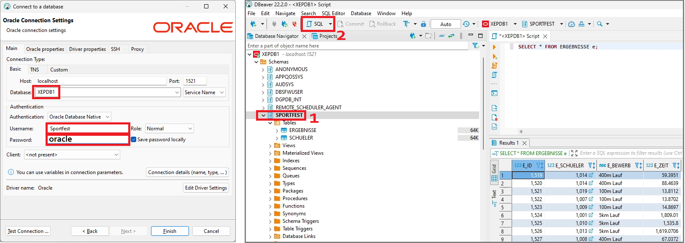

# Analytische Funktionen in Oracle

> **Hinweis:** Analytische Funktionen gibt es auch in anderen Datenbanksystemen. Die Anweisungen
> können also auch in SQLite oder SQL Server ausgeführt werden.

Dieses Kapitel benötigt einen Docker Container mit Oracle 21 XE. Du kannst das Image mit
dem folgenden Befehl laden und den Container stellen:

```
docker run -d -p 1521:1521 -e ORACLE_PASSWORD=oracle -v C:/Temp/oracle-home:/home --name oracle21c gvenzl/oracle-xe:21-full
```

Erstelle nun in Oracle einen User *Sportfest* mit dem Passwort *oracle*. Öffne dafür die Shell
des Oracle Containers in Docker Desktop und kopiere den folgenden Befehl in die Shell:

```bash
sqlplus system/oracle@//localhost/XEPDB1 <<< "
    DROP USER Sportfest CASCADE;
    CREATE USER Sportfest IDENTIFIED BY oracle;
    GRANT CONNECT, RESOURCE, CREATE VIEW TO Sportfest;
    GRANT UNLIMITED TABLESPACE TO Sportfest;
"

```

> Hinweis: Nach dem Starten des Containers kann es einige Sekunden dauern, bis sich sqlplus
> zur Datenbank verbinden kann. Falls die Meldung 
> *ORA-12514: TNS:listener does not currently know of service requested in connect descriptor*
> erscheint, setze den Befehl etwas später wieder ab.

Nun befülle die Datenbank des Users *Sportfest* mit den folgenden Kommandos. Kopiere diese
Befehle einfach in die Shell des Oracle Containers:

```bash
cd /tmp
curl https://raw.githubusercontent.com/schletz/Dbi3Sem/master/02_Analytical%20Functions/sportfest.sql > sportfest.sql
echo exit | sqlplus Sportfest/oracle@//localhost/XEPDB1 @sportfest.sql

```

Verbinde dich nun mit DBeaver oder SQL Developer mit dem User *Sportfest* (Passwort *oracle*).



Unsere Datenbank speichert die einzelnen Bewerbe nach Abteilung, Klasse, Geschlecht und Bewerb. Die
Anzahl der Datensätze gibt folgende Tabelle an:

| S_ABTEILUNG	| S_KLASSE	| S_GESCHL	| E_BEWERB 	| SCHUELER	| ROWS	| 
| -----------	| --------	| --------	| ---------	| ---	| ----	| 
| FIT        	| 1AFIT   	| m       	| 100m Lauf	| 3  	| 30  	| 
| FIT        	| 1AFIT   	| m       	| 400m Lauf	| 3  	| 24  	| 
| FIT        	| 1AFIT   	| m       	| 5km Lauf 	| 3  	| 37  	| 
| FIT        	| 1AFIT   	| w       	| 100m Lauf	| 2  	| 17  	| 
| FIT        	| 1AFIT   	| w       	| 400m Lauf	| 2  	| 18  	| 
| FIT        	| 1AFIT   	| w       	| 5km Lauf 	| 2  	| 16  	| 
| FIT        	| 1BFIT   	| m       	| 100m Lauf	| 3  	| 35  	| 
| FIT        	| 1BFIT   	| m       	| 400m Lauf	| 3  	| 28  	| 
| FIT        	| 1BFIT   	| m       	| 5km Lauf 	| 3  	| 30  	| 
| FIT        	| 1BFIT   	| w       	| 100m Lauf	| 2  	| 22  	| 
| FIT        	| 1BFIT   	| w       	| 400m Lauf	| 2  	| 18  	| 
| FIT        	| 1BFIT   	| w       	| 5km Lauf 	| 2  	| 18  	| 
| HIF        	| 1AHIF   	| m       	| 100m Lauf	| 3  	| 31  	| 
| HIF        	| 1AHIF   	| m       	| 400m Lauf	| 3  	| 36  	| 
| HIF        	| 1AHIF   	| m       	| 5km Lauf 	| 3  	| 35  	| 
| HIF        	| 1AHIF   	| w       	| 100m Lauf	| 2  	| 25  	| 
| HIF        	| 1AHIF   	| w       	| 400m Lauf	| 2  	| 20  	| 
| HIF        	| 1AHIF   	| w       	| 5km Lauf 	| 2  	| 12  	| 
| HIF        	| 1BHIF   	| m       	| 100m Lauf	| 3  	| 33  	| 
| HIF        	| 1BHIF   	| m       	| 400m Lauf	| 3  	| 36  	| 
| HIF        	| 1BHIF   	| m       	| 5km Lauf 	| 3  	| 31  	| 
| HIF        	| 1BHIF   	| w       	| 100m Lauf	| 2  	| 24  	| 
| HIF        	| 1BHIF   	| w       	| 400m Lauf	| 2  	| 19  	| 
| HIF        	| 1BHIF   	| w       	| 5km Lauf 	| 2  	| 18  	| 
