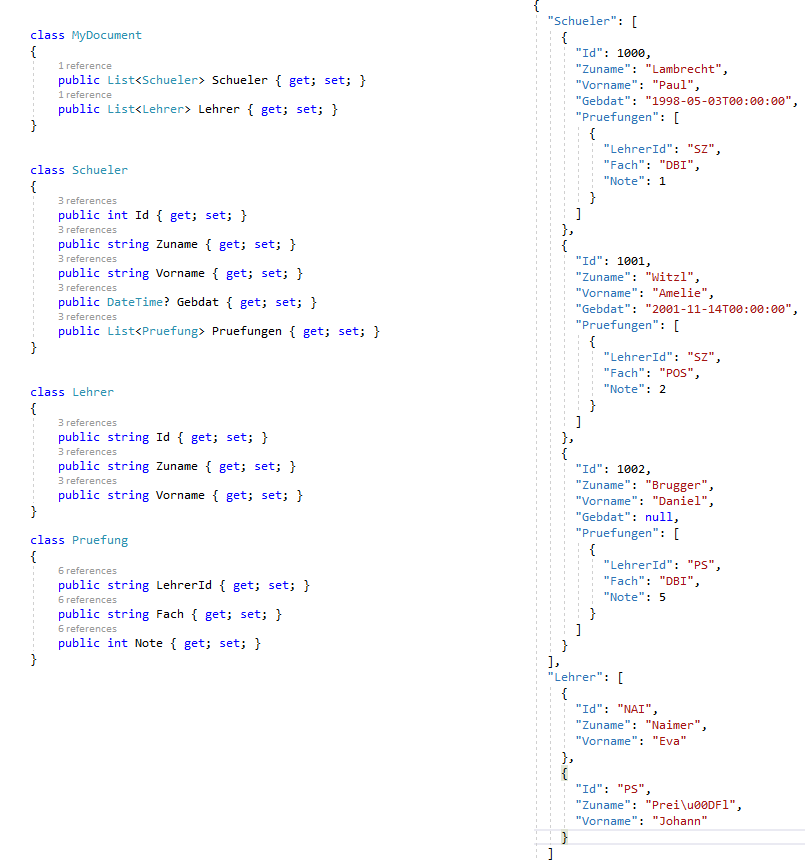

# Erstellen von Modelklassen für JSON Dokumente

## Was sind POCO bzw. POJO Klassen?

POCO (Plain Old CLR Object) bzw. POJO (Plain Old Java Object) Klassen bezeichnen C# bzw. Java
Klassen, die keine komplexen OOP Features wie Vererbung, Interfaces oder Annotations aufweisen.
Sie werden im Bereich des OR Mappings verwendet, um den Inhalt von Datenbanktabellen abzubilden.

Eine typische POCO Klasse in C# kann wie folgt aussehen. Sie besitzt lediglich Properties, die Daten
einer Schülertabelle aus einer Datenbank aufnehmen können.

```c#
class Schueler
{
    public int Id { get; set; }
    public string Zuname { get; set; }
    public string Vorname { get; set; }
    public DateTime Gebdat { get; set; }
}
```

## Mapping von Datentypen

Im Vergleich zu C# bietet JSON nur die Unterscheidung zwischen number, string, object und
array an. Dadurch
werden einige Typen auf den selben JSON Typ abgebildet. Falsche Zuordnungen machen sich durch
Laufzeitfehler bei der Deserialisierung (dem Einlesen der JSON Datei) bemerkbar.

| .NET Datentyp               | JSON Typ                      |
| -------------------------   | ----------------------------- |
| int, double, decimal, ...   | number                        |
| DateTime                    | string                        |
| string                      | string                        |
| `List<T>`, Array            | Array (gleichartige Elemente) |
| `List<object>`              | Array (verschiedene Elemente) |
| `Dictionary<Tkey, Tval>`    | Allgemeine Key/Valuedaten     |

## Abbilden eines Dokumentes mit Properties und den .NET Datentypen

Folgendes Beispiel zeigt unsere Prüfungsdatei (Schüler mit Prüfungen sowie Lehrer) auf der rechten
Seite. Auf der linken Seite sind die entsprechenden POCO Klassen in C# abgebildet.



Folgendes fällt auf:

- Die oberste Ebene im JSON ist ein Objekt (es beginnt mit `{`). Daher wird das gesamte
  Dokument in der Klasse *MyDocument* abgebildet. Bei einem Array wäre die oberste Ebene ein Array
  oder eine Liste in C#.
- Das Array von Schülern wird in C# als `List<Schueler>` abgebildet. Ein Array ist ebenfalls
  möglich, bietet aber keine Möglichkeit, Datensätze hinzuzufügen oder zu entfernen.
- *DateTime* ist ein Wertetyp. Um den *null* Wert beim Geburtsdatum speichern zu können, muss daher
  der nullable Type *DateTime?* verwendet werden.

In .NET Core (ab Version 3) ist bereits im Namespace *System.Test.Json* eine Möglichkeit
integriert, die Datei mit 2 Codezeilen einzulesen. Es wird eine fertig befüllte Instanz von
MyDocument zurückgegeben.

```c#
using var filestream = new FileStream("pruefungen.json", FileMode.Open, FileAccess.Read);
MyDocument pruefungen = await JsonSerializer.DeserializeAsync<MyDocument>(filestream);
```

## Übung 1

Erstellen Sie eine neue C# Konsolenapplikation mit dem Namen *JsonDemo* und öffnen sie die
Projektdatei in Visual Studio (oder der IDE Ihrer Wahl)

```text
Path>md JsonDemo
Path>cd JsonDemo
Path>dotnet new console
Path>start JsonDemo.csproj
```

Laden Sie die Datei [stundenplan.json](stundenplan.json) herunter und kopieren Sie sie in ihren
Projektordner. Bei den Eigenschaften der Datei im Solution Explorer müssen Sie wieder *Copy Always*
angeben.

Ersetzen Sie nun die Datei *Program.cs* durch den angegebenen Inhalt. Schreiben Sie die Modelklassen,
sodass sie die Datei [stundenplan.json](stundenplan.json) eingelesen (deserialisiert) werden kann.
Mit Ihren Modelklassen erledigen Sie danach die folgenden Aufgaben, indem Sie z. B. mit
*foreach* durch die Collections iterieren:

- Geben Sie alle Lehrer (ID, Vorname, Zuname) der Schule auf der Konsole aus.
- Geben Sie alle Gegenstände (ID, Name) der Schule auf der Konsole aus.


```c#
using System;
using System.Collections.Generic;
using System.IO;
using System.Text.Json;
using System.Threading.Tasks;

namespace JsonDemo
{
    // TODO: Schreiben Sie Ihre Modelklassen, die das Dokument stundenplan.json abbilden können.
    class Klasse
    {

    }


    class Program
    {
        static async Task Main()
        {
            // Wichtig: Bei Copy to Output Directory muss im Solution Explorer bei stundenplan.json
            //          die Option Copy Always gesetzt werden-
            using var filestream = new FileStream("stundenplan.json", FileMode.Open, FileAccess.Read);

            // Liest das Dokument in die Variable stdplan ein. Da es ein Array ist, wird hier auch
            // ein Array erstellt.
            Klasse[] stdplan = await JsonSerializer.DeserializeAsync<Klasse[]>(filestream);
            Console.WriteLine($"Es wurden {stdplan.Length} Klassen geladen.");

            // TODO: Geben Sie alle Lehrer (ID, Vorname, Zuname) der Schule aus.

            // TODO: Geben Sie alle Gegenstände (ID, Name) der Schule aus.
        }


    }
}
```

## Übung 2

Sie haben durch die Ausgabe der Lehrer oder der Gegenstände festgestellt, dass die Datenstruktur
für diese Aufgabe nicht optimal gewählt ist. Passen Sie ihre Modelklassen an, sodass
die Lehrer und Gegenstände der Schule ohne Duplikate ausgegeben werden können. Für die Darstellung
des Stundenplanes reichen die Grundinformationen, die Sie auch in WebUntis sehen.
