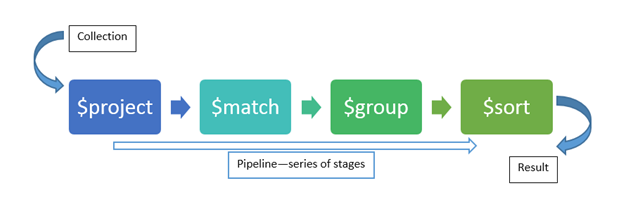

# Aggregation und Projektion

Die Datenbank Stundenplan wird mit dem Programm in [05_MongoDb_Aggregation](06_MongoDb_Aggregation)
erzeugt und beinhaltet 3 Collections: Schueler, Klasse und Lehrer.

```c#
class Schueler
{
    [BsonId]
    public Guid Id { get; set; } = Guid.NewGuid();
    public string Vorname { get; set; }
    public string Zuname { get; set; }
    public DateTime? Gebdat { get; set; }
    public string KlasseId { get; set; }
}
class Klasse
{
    [BsonId]
    public string Id { get; set; }
    public string KvId { get; set; }
}
class Lehrer
{
    [BsonId]
    public string Id { get; set; }
    public string Vorname { get; set; } = "";
    public string Zuname { get; set; } = "";
    public string Email { get; set; } = "";
}        
```

## Aggregation Pipelines in der Mongo Shell

> The aggregation pipeline is a framework for data aggregation modeled on the concept of data
> processing pipelines. Documents enter a multi-stage pipeline that transforms the documents into
> aggregated results.<sup>(https://docs.mongodb.com/manual/core/aggregation-pipeline/)</sup>



<sup>Quelle: https://www.codeproject.com/Articles/1149682/Aggregation-in-MongoDB</sup>

Für die folgenden Beispiele öffnen wir die Mongo Shell in der Konsole mit `C:\MongoDB\bin>mongo.exe`.

### Gruppierungen ($group)

In SQL sind Aggregierungen auch (fast) immer mit entsprechenden Gruppierungen verbunden. Wollen wir
die Anzahl der Schüler pro Klasse zählen, so kann dies mit folgenden SQL Statement formuliert werden:

```sql
SELECT KlasseId, COUNT(*), MIN(Gebdat) AS Juengster
FROM Schueler
```

Wollen wir nun in MongoDB die Collection Schueler nach diesen Informationen abfragen, so mützen wir
die Funktion *aggregate* nutzen. Aggregate führt die Pipeline aus, die in unserem Beispiel nur
aus der Gruppierungsebene besteht.

Die Technik des Zählens ist jedoch anders: Die Anzahl wird so ermittelt, dass für jedes Dokument
der Wert 1 aufsummiert wird. Die Aggregatsfunktionen können mit *$sum* und *$min* und dem Key,
der für die Berchnung verwendet wird, angegeben werden.

```text
> use Stundenplan
> db.Schueler.aggregate([ 
    { $group: { _id: "$KlasseId", anzahl: { $sum: 1 }, juengster: {$min: "$Gebdat"} } }    
  ]);

{ "_id" : "2DHIF", "anzahl" : 30, "juengster" : ISODate("2000-01-24T00:00:00Z") }
{ "_id" : "5AHIF", "anzahl" : 29, "juengster" : ISODate("2000-01-21T00:00:00Z") }
{ "_id" : "5DHIF", "anzahl" : 13, "juengster" : ISODate("2000-09-26T00:00:00Z") }
{ "_id" : "3CAIF", "anzahl" : 18, "juengster" : ISODate("2000-01-28T00:00:00Z") }
{ "_id" : "5BAIF", "anzahl" : 24, "juengster" : ISODate("2000-01-03T00:00:00Z") }
{ "_id" : "2BBIF", "anzahl" : 21, "juengster" : ISODate("2000-03-11T00:00:00Z") }
{ "_id" : "2BAIF", "anzahl" : 18, "juengster" : ISODate("2000-01-21T00:00:00Z") }
{ "_id" : "3DBIF", "anzahl" : 19, "juengster" : ISODate("2000-01-27T00:00:00Z") }
{ "_id" : "1BHIF", "anzahl" : 28, "juengster" : ISODate("2000-02-01T00:00:00Z") }
```

Da wir eine Pipeline haben, können wir nach der Gruppierung auch nach diesen ermittelten Werten
sortieren. -1 bedeutet absteigende, 1 bedeutet aufsteigende Sortierung.

```text
> db.Schueler.aggregate([
    { $group: { _id: "$KlasseId", anzahl: { $sum: 1 } } },
    { $sort: { anzahl: -1 } }
  ]);

{ "_id" : "2DHIF", "anzahl" : 30 }
{ "_id" : "5AHIF", "anzahl" : 29 }
{ "_id" : "1BHIF", "anzahl" : 28 }
{ "_id" : "5BAIF", "anzahl" : 24 }
{ "_id" : "2BBIF", "anzahl" : 21 }
{ "_id" : "3DBIF", "anzahl" : 19 }
{ "_id" : "2BAIF", "anzahl" : 18 }
{ "_id" : "3CAIF", "anzahl" : 18 }
{ "_id" : "5DHIF", "anzahl" : 13 }
```

Wollen wir einfach die Anzahl der Schüler in der Collection zählen, so verwenden wir folgenden
Trick: Wir gruppieren nach einem fixen Wert (z. B. 1).

```text
> db.Schueler.aggregate([
    {$group: { _id: 1, anzahl: { $sum: 1 } } } 
  ]);

{ "_id" : 1, "anzahl" : 200 }
```

### Filtern mit $match und $group

Mit *WHERE* können wir in SQL vor der Gruppierung die Werte filtern:

```sql
SELECT KlasseId, COUNT(*) AS Anzahl
FROM Schueler
WHERE KlasseId LIKE '%HIF'
```

In MongoDB haben wir mit *$match* die Möglichkeit, in der Pipeline diese Filterung vorzunehmen. In
diesem Beispiel übergeben wir einen regulären Ausdruck (*/HIF$/*), der bedeutet, dass die Klassen ID
mit HIF enden muss.

```text
> db.Schueler.aggregate([
    { $match: { KlasseId: /HIF$/ } }, 
    { $group: { _id: "$KlasseId", anzahl: { $sum: 1 } } },
    { $sort: { anzahl: -1 } }
  ]);

{ "_id" : "2DHIF", "anzahl" : 30 }
{ "_id" : "5AHIF", "anzahl" : 29 }
{ "_id" : "1BHIF", "anzahl" : 28 }
{ "_id" : "5DHIF", "anzahl" : 13 }
```

## Abbildung in LINQ

Zum Glück müssen wir als .NET Programmierer diese Methoden nicht händisch aufrufen. Der MongoDB
Treiber für .NET erstellt aus den gewohnten LINQ Aggregationsmethoden wie *GroupBy()*, *Count()*, ...
die entsprechende Pipeline.

```c#

_db.GetCollection<Schueler>(nameof(Schueler))
  .AsQueryable()
  .Where(s => s.KlasseId.EndsWith("HIF"))               // Erzeugt $match
  .GroupBy(s => s.KlasseId)                             // Erzeugt $group
  .Select(g => new { Id = g.Key, Count = g.Count() })   // Projektion
  .OrderBy(g => g.Count).ThenBy(g => g.Id)              // Erzeugt $sort
```

- MongoDB Aggregation: https://docs.mongodb.com/manual/aggregation/
- MongoDB Treiber Referenz: http://mongodb.github.io/mongo-csharp-driver/2.11/reference/

## Erweiterung des Repositories um spezifische Methoden

Im vorigen Kapitel wurde ein Repository erstellt, welche auf die Collection zugreifen kann. Im
Programm [06_MongoDb_Aggregation](06_MongoDb_Aggregation) wurde dieses Konzept erweitert:

- Es gibt einen RepositoryManager, der die Verbindung zur Datenbank herstellt.
- Jede Collection ist durch ein eigenes generisches Repository abgebildet.
- Die Collection Schueler hat ein eigenes Repository, welches vom generischen Repository abgeleitet wurde.

Die Details sind im Programmcode beschrieben.
