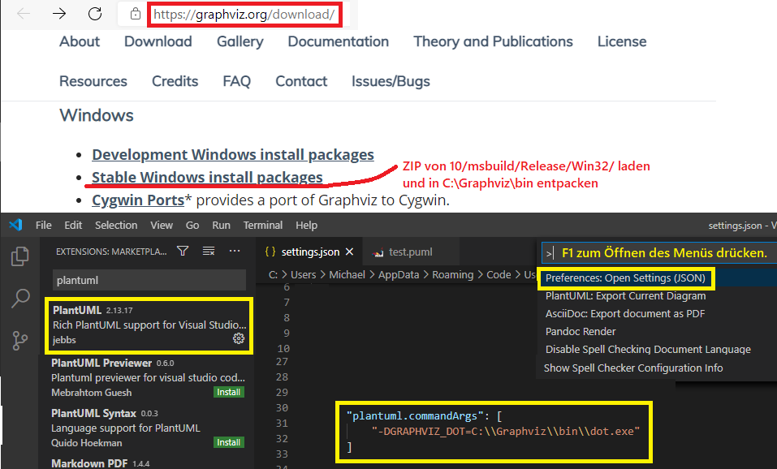
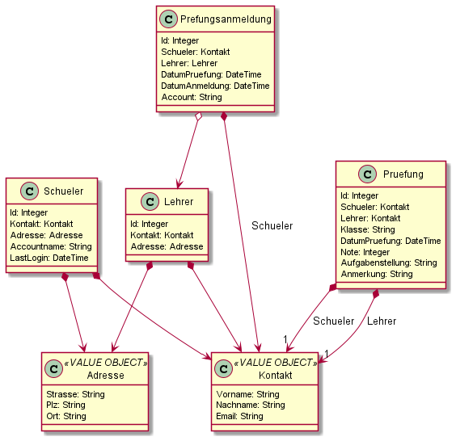

# Modellierung von NoSQL Datenbanken

## Embedding vs. Referencing
https://docs.microsoft.com/en-us/azure/cosmos-db/modeling-data

## PlantUML Klassendiagramme als Modellierungswerkzeug

### Installation mit VS Code

Für die Erstellung von Diagrammen in PlantUML gibt es unter Windows mit VS Code folgende Möglichkeit:

(1) *graphviz-2.44.1-win32.zip* von https://www2.graphviz.org/Packages/stable/windows/10/msbuild/Release/Win32/
    laden und das ZIP nach *C:\Graphviz* entpacken. In C:\Graphviz\bin muss die Datei dot.exe zu finden sein.
    
(2) In VS Code die Erweiterung PlantUML installieren und in der settings.json die Konfiguration

```javascript
"plantuml.commandArgs":
	[ "-DGRAPHVIZ_DOT=C:\\Graphviz\\bin\\dot.exe" ]
```
einfügen.

(3) Eine neue Datei mit der Erweiterung .puml erstellen. Alt+D aktiviert die Vorschau.Syntax: https://plantuml.com/class-diagram bzw. https://plantuml.com/ie-diagram



## Modellierungsbeispiel "Kolloqienanmeldung"



```text
@startuml

class Kontakt << VALUE OBJECT >> {
    Vorname: String
    Nachname: String
    Email: String
}

class Adresse << VALUE OBJECT >> {
    Strasse: String
    Plz: String
    Ort: String
}

class Schueler {
    Id: Integer
    Kontakt: Kontakt
    Adresse: Adresse
    Accountname: String
    LastLogin: DateTime
}

class Lehrer {
    Id: Integer
    Kontakt: Kontakt
    Adresse: Adresse
}

' Zeitverlauf (Lebenszyklus)
' Eine Prüfungsanmeldung ist vor der Prüfung.
' Am Tag der Prüfung entstehen dann die weiteren Infos wie
' Aufgabenstellung, Note, ...
class Prefungsanmeldung {
    Id: Integer
    Schueler: Kontakt
    Lehrer: Lehrer
    DatumPruefung: DateTime
    DatumAnmeldung: DateTime
    Account: String
}

class Pruefung {
    Id: Integer
    Schueler: Kontakt
    Lehrer: Kontakt
    Klasse: String 
    DatumPruefung: DateTime
    Note: Integer
    Aufgabenstellung: String
    Anmerkung: String
}

' Aggregation (has-a Beziehung)
Prefungsanmeldung o--> Lehrer

' Composition (part-of Beziehung)
Schueler *--> Adresse
Schueler *--> Kontakt
Lehrer *--> Adresse
Lehrer *--> Kontakt

Pruefung *--> "1" Kontakt : "Schueler"
Pruefung *--> "1" Kontakt : "Lehrer"
Prefungsanmeldung *--> Kontakt : "Schueler"

@enduml
```
