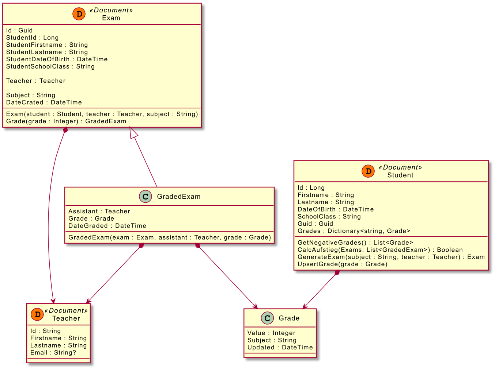

# Modellierung von NoSQL Datenbanken

## Embedding vs. Referencing
https://docs.microsoft.com/en-us/azure/cosmos-db/modeling-data

## Musterprojekt
Im Ordner *Projekt Pruefungsverwaltung* ist eine Beispielapplikation einer Prüfungsverwaltung gespeichert.
Sie basiert auf .NET 5 und kann wie folgt gestartet werden:

- Starte MongoDB auf dem Rechner.
- Starte *Projekt Pruefungsverwaltung\ExamManager\startServer.cmd*

Es wird eine ASP.NET Core WebAPI gestartet (Port 5001) und ein Web Frontend mit Blazor Webassembly
(Port 5002). Das Datenmodell ist wie folgt definiert:

Details sind im Ordner [Projekt Pruefungsverwaltung](Projekt%20Pruefungsverwaltung) enthalten.
