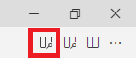

# Übung zur MongoDb Modellierung

## PlantUML und VS Code als Modellierungswerkzeug

Im Gegensatz zu relationalen Datenbanken, wo ER Diagramme als datenbankenunabhängiges Modellierungstool
verwendet werden können, gibt es für NoSQL keine einheitliche "Modellierungssprache". Da aber
schlussendlich der Datenbestand mittels Modelklassen in Java oder C# verwaltet wird (bzw. werden kann)
können Klassendiagramme verwendet werden. Solche Diagramme könenn wie folgt erzeugt werden:

1. Prüfe, ob Java installiert und im PATH eingetragen ist. Der Befehl *java -version* muss erkannt werden.
1. Installiere [Visual Studio Code](https://code.visualstudio.com). Achtung: Aktiviere beim Setup
   die Option "In den Explorer integrieren", damit Sie im Kontextmenü VS Code starten können.
1. Installiere die folgenden Extensions:
   - Markdown PDF
   - Markdown Preview Enhanced
   - PlantUML
1. Öffne die VS Code Konfiguration (*F1* - "*settings*" eingeben - "*Preferences: Open Settings (JSON)*" wählen)
   und füge folgende Zeilen hinzu:

```javascript
    "markdown-pdf.plantumlOpenMarker": "```plantuml\n",
    "markdown-pdf.plantumlCloseMarker": "```"   
```

Nun steht durch die Extension *Markdown Preview Enhanced* ein Icon bereit, welches eine Vorschau mit
dem gerenderten Diagramm bietet:


Unter [Modell.md](Projekt%20Pruefungsverwaltung/01%20Modell.md) sehen Sie ein Beispiel für ein
PlantUml Modell, wo Sie die Syntax für Embeddings, etc. sehen können.

## Angabe

Auf https://e-formular.spengergasse.at/Infotag/Buchung können sich BesucherInnen für
den Infotag vorregistrieren. Es können Termine für verschiedene Abteilungen definiert
werden.

Ein Termin kann durchaus mehrfach vergeben werden. Vergleichen Sie die Situation mit
den Impfkojen im Austria Center. Wenn Sie 10 Kojen (= Stationen) haben, dann können auch 10 BesucherInnen
um 15:00 erscheinen. Die Anzahl der Stationen kann pro Abteilung individuell festgelegt
werden.

Parallel gibt es auch online Termine. Diese können unabhängig definiert werden (Zeit und
Anzahl der Stationen). Vergleichbar mit Impf- und Testkojen.

Wie auf der Buchungsmaske ersichtlich gibt es bis zu 2 BesucherInnen. Ein Hauptbesucher,
der Name, Telefonnummer und E-Mail Adresse hinterlässt. Der 2. Besucher ist optional und muss nur Name und Vorname angeben.


Hinweise zur Umsetzung
- Die zentrale Klasse ist die Klasse *Termin*.
- Ein Termin kann mehrere Stationen haben.
- Ein Termin kann ein online oder offline Termin sein (Vererbung)
- Der online Termin speichert noch einen Meeting Link.
- Der offline Termin kann einen 2. Besucher (Begleiter) haben.
- Die BesucherInnen können in einer Liste gespeichert werden.
- Besucher und Begleiterproblem: Sie müssen immer eindeutig den Zusammenhang zwischen
  Besucher und Begleiter herstellen können.

### Aufgabe

Erstellen Sie ein neues MD File in Visual Studio Code mit dem Namen *Terminverwaltung.md*
Definieren Sie Ihr PlantUML Klassendiagramm in dieser Datei.

Danach können Sie im Musterprogramm zu "Find" im [Ordner 03_MongoDb_Find](03_MongoDb_Find)
diese Klassen in C# definieren. Dafür müssen Sie das Repository klonen, falls Sie das
nicht schon gemacht haben (`git clone https://github.com/schletz/Dbi3Sem.git`). Achten Sie auf die Konstruktoren und Datentypen.