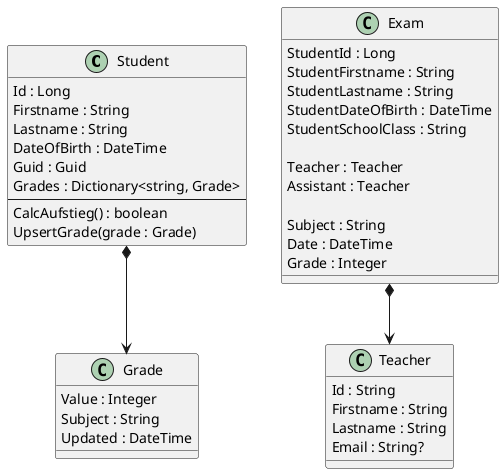

# Eine kleine Prüfungsverwaltung

Von unserer Schülerverwaltung bekommen wir 2 Exportdateien (CSV):

- **Schüler** mit Schülernr, Name, Klasse, Geburtsdatum, ...
- **Zeugnisnoten** mit Schülernr, Fach, Note
- **Lehrerdaten** mit Kürzel, Name, Email

Wir möchten ein Tool schreiben, mit dem folgende
Dinge erledigt werden können

- **Prüferzuteilung** Es können für negative Noten Prüfungen angelegt werden. Diese Prüfung hat einen Prüfer.

- **Beurteilung** Der Prüfer gibt die Note ein, es kann ein Protokoll mit Name, Prüfer und Note erstellt werden.

- **Aufstieg** Es soll ermittelt werden können, wie viele Schüler nach den Prüfungen positiv sind, sich also alle negativen Noten ausgebessert haben.

## Anmerkungen

Student ist ein Aggregate für Grade, da die Noten des
Schülers eingebettet werden. Daher gibt es keine
Collection Grades in der Datenbank und Grade hat auch keine Id. Der Schüler verwaltet also seine Noten.
Nachteil 1: Möchte man die Noten wissen, muss zuerst
der Schüler gelesen werden. Für den Notendurchschnitt für ein Fach wissen, muss also die ganze Schülercollection gelesen werden.
Nachteil 2: Wird das System auch zur Noteneingabe
verwendet, so muss immer der Schüler gelesen, aktualisiert und geschrieben werden. Greifen 2 Lehrer gleichzeitig darauf zu, führt das zu Problemen.