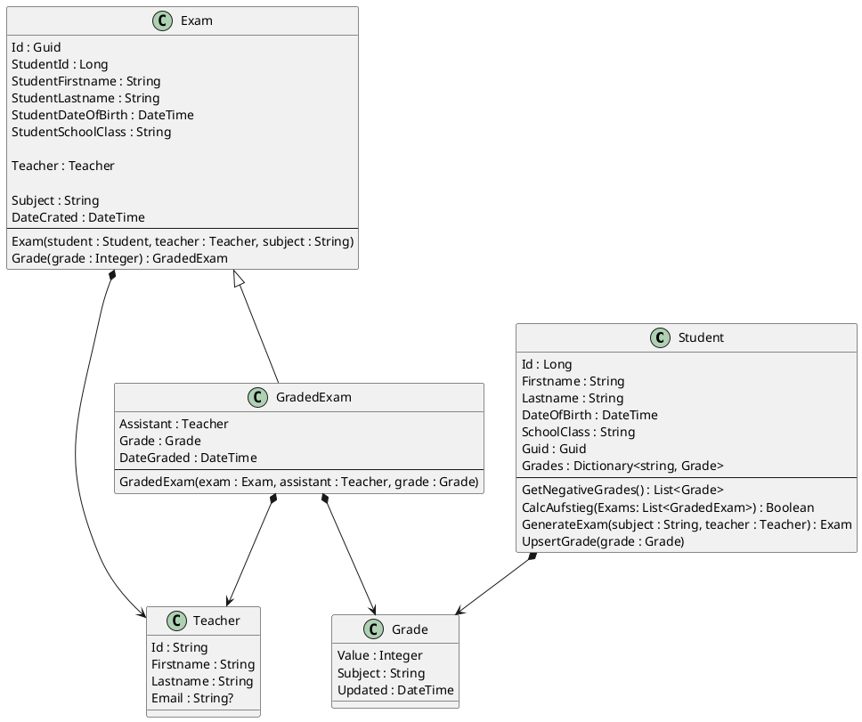

# Eine kleine Prüfungsverwaltung

Von unserer Schülerverwaltung bekommen wir verschiedene Exportdateien (CSV):

- **Schüler** mit Schülernr, Name, Klasse und Geburtsdatum.
- **Zeugnisnoten** mit Schülernr, Fach und Note.
- **Lehrerdaten** mit Kürzel, Name und Email (optional).

Wir möchten ein Tool schreiben, mit dem folgende Aufgaben erledigt werden können

- **Prüferzuteilung** Es können für negative Noten Prüfungen (Exams) angelegt werden. Diese Prüfung   
  hat einen Gegenstand (subject), einen Prüfer (teacher) und einen Schüler (student).
- **Beurteilung** Der Prüfer gibt im Herbst die Note ein und es kann ein Protokoll mit Name, Prüfer 
  und Note erstellt werden. Bei der Beurteilung ist dann auch der Beisitzer (Assistant) bekannt, der 
  vorher noch nicht feststeht.
- **Aufstieg** Es soll ermittelt werden können, ob ein Schüler nach den Prüfungen positiv ist, 
  sich also alle negativen Noten ausgebessert hat (der Aufstieg mit einem Nicht genügend wird
  als Vereinfachung nicht berücksichtigt, denn es wären hierfür auch die Noten des letzten Jahres 
  erforderlich).

## Modell

Ein Domänenmodell für diese Aufgaben kann wie folgt aussehen:

## Anmerkungen

### Notation

Der Pfeil in UML bedeutet navigierbarkeit. Von *Exam* kann über das Property *Teacher* in das
Teacherobjekt navigiert werden. Daher geht der Pfeil von *Exam* zu *Teacher*. Der Diamond
bedeutet eigentlich *Komposition*. Wir verwenden in NoSQL dieses Symbol für *embedding*, da
der Teacher mit dem Exam gelesen und somit auch erzeugt wird.

### Teacher: Embedding und eigene Collection

Die Teacherklasse hat eine Id und ist somit auch ein eigenständiges Dokument. Sie wird in
der Collection Teacher gespeichert. Zusätzlich werden die Lehrer, die die Prüfung durchführen,
eingebettet.
- **Vorteil**: Werden die Lehrer neu importiert, bleibt die Information des Prüfers davon unberührt
  und kann später auf das Protokoll gedruckt werden.
- **Nachteil**: Diese Eigenschaft kann auch ein Nachteil sein. In unserem Fall nicht zutreffend,
  aber würden wir z. B. eine Änderung der Mailadresse auch bei den Prüfungen speichern wollen,
  müssten wir alle Prüfungen lesen und die betreffenden eingebetteten Lehrer auch ändern.

### Student Collection
Student ist ein Aggregate für Grade, da die Noten des Schülers eingebettet werden. Daher gibt es
*keine Collection Grades* in der Datenbank und Grade hat auch keine Id. Der Schüler verwaltet also
seine Noten. 
- **Vorteil**: Methoden der Student Klasse können auf die Collection zugreifen und haben alle
  Noten. Dies ist für die Berechnung des Aufstiegs wichtig. Deswegen werden die Noten in
  diesem Beispiel auch als Collection eingebettet (aggregate pattern). Da die Noten einmalig
  importiert und nicht bearbeitet werden, ist dies eine gute Lösung.
- **Nachteil 1:** Möchte man die Noten wissen, muss zuerst der Schüler gelesen werden. Um
den Notendurchschnitt für ein Fach zu ermitteln, muss also die ganze Schüler Collection gelesen werden.
- **Nachteil 2:** Wird das System auch zur Noteneingabe verwendet, so muss immer der Schüler gelesen,
aktualisiert und geschrieben werden. Greifen 2 Lehrer gleichzeitig darauf zu, führt das zu Problemen.

### Exam und GradedExam

Exam speichert die Basisdaten des Schülers. Es wird nicht das gesamte Schülerobjekt eingebettet,
da sonst bei jeder Prüfung auch alle Noten eingebettet werden. Das ist nicht notwendig und würde
die Datenbank nur unnötig vergrößern.

Über die Vererbung wird der State des Objektes abgebildet. Dadurch können bestimmte Methoden wie
*CalcAufstieg()* den Typ GradedExam verlangen. In der Datenbank werden alle Prüfungen in der Collection
*Exam* verwaltet. MongoDB generiert automatisch ein Feld *_t*, welches den Typ speichert.
Beim Auslesen kann - auch wenn alle Prüfungen in einer Collection verwaltet werden - ein
Objekt vom Typ GradedExam erzeugt werden. Mit *is* (*instanceof* in Java) kann der Typ der
Prüfung bei Bedarf festgestellt werden.
