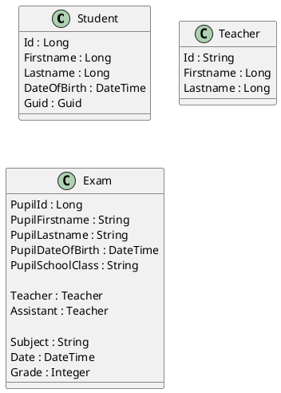

# Eine kleine Prüfungsverwaltung

Von unserer Schülerverwaltung bekommen wir 2 Exportdateien (CSV):

- **Schüler** mit Schülernr, Name, Klasse, Geburtsdatum, ...
- **Zeugnisnoten** mit Schülernr, Fach, Note
- **Lehrerdaten** mit Kürzel, Name, Email

Wir möchten ein Tool schreiben, mit dem folgende
Dinge erledigt werden können

- **Prüferzuteilung** Es können für negative Noten Prüfungen angelegt werden. Diese Prüfung hat einen Prüfer.

- **Beurteilung** Der Prüfer gibt die Note ein, es kann ein Protokoll mit Name, Prüfer und Note erstellt werden.

- **Aufstieg** Es soll ermittelt werden können, wie viele Schüler nach den Prüfungen positiv sind, sich also alle negativen Noten ausgebessert haben.

