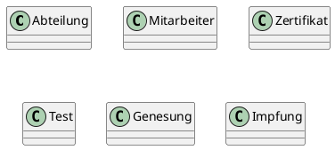

# 3G Check

Laut den Vorschriften müssen ArbeitnehmerInnen am Arbeitsplatz ihre "geringe epidemiologische Gefahr"
vorweisen. Sie können das auf (vereinfacht) 3 Arten vornehmen:
- Impfzertifikat
- Genesungszertifikat
- Testzertifikat (Antigentest oder PCR Test).

Eine Firma beauftragt Sie, die Daten der MitarbeiterInnen zu speichern. Es soll auf Knopfdruck
herausgefunden werden, ob alle ArbeitnehmerInnen den Nachweis erbracht haben. Die ArbeitnehmerInnen
spielen die Zertifikate selbstständig in Ihr System ein. Dafür melden sie sich mit der Email
Adresse an. Die Nachweise haben alle ein Datum der
Probenentnahme (oder Impfdatum) und sind einer Person zugeordnet. Eine ArbeitnehmerIn kann auch
mehrere Zertifikate einspielen.
Beim Impfzertifikat ist noch der Name des Impfstoffes (z. B. Astra Zeneca) zu erfassen. Weiters
ist das Alter der MitarbeiterInnen wichtig, da vielleicht für nicht volljährige Lehrlinge andere
Regelungen gelten.

ArbeitnehmerInnen arbeiten in Abteilungen. Die Abteilungsleitung darf nur die Testergebnisse der
eigenen Abteilung einsehen.

Entwerfen Sie ein Klassenmodell, welches diese Daten speichert und in eine NoSQL Datenbank persistieren
kann.

