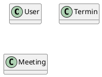

# Ein Aufgabenplaner

Sie möchten für BenutzerInnen eine Terminverwaltung zur Verfügung stellen. Dabei gibt es folgende
Anforderungen:
- Der Benutzer wird mit Vorname, Nachname und Email erfasst.
- Der Termin besitzt ein Von und Bisdatum, eine Beschreibung und (optional) einen Ort.
- Meetings sind spezielle Termine. Sie besitzen zusätzlich noch eine Liste der Teilnehmer.

### Schritt 1: Properties
Das nachfolgende Modell zeigt bereits die 3 datenhaltenden Klassen. Fügen Sie die Attribute
hinzu, damit die obigen Informationen gespeichert werden können.

### Schritt 2: Navigationen
Überlegen Sie sich, wie die Klassen verknüpft werden können (Navigationen oder Vererbung). 
Schließlich muss ja festgestellt werden, welche Termine welchen Benutzern gehören.
Diskutieren Sie 2 Lösungsmöglichkeiten:
- Der Benutzer hat eine Liste von Terminen.
- Der Termin hat einen Verweis auf den Benutzern.

Können Sie die erste Variante überhaupt realisieren? Achten Sie auf "Kreise" im Modell.

### Schritt 3: Collections und Documents
Definieren Sie die benötigten Dokumentklassen. Sie können die Dokumente mit `<<(D,#FF7700) Document>>`
in der Klassendefinition kenntlich machen, wie folgendes Beispiel zeigt:
```
class DemoDocument <<(D,#FF7700) Document>> {

}
```

### Schritt 4: (optional für sehr gute Arbeiten)
Erstellen Sie eine kleine C# Konsolenapplikation. Im Ordner *03_MongoDb_Find* finden
Sie ein kleines Musterprogramm, welches den Zugriff auf eine MongoDb Datenbank zeigt.
- Schreiben Sie die Modelklassen mit Konstruktoren
- Fügen Sie einen User mit einigen Terminen hinzu.
- Kontrollieren Sie im MongoDb Compass, ob die Daten korrekt geschrieben wurden.

## Musterdatei

Erstellen Sie in VS Code eine neue Datei *kalender_loesung.md*. Kopieren Sie den Inhalt der Datei [kalender_loesung.md](kalender_loesung.md) hinein (RAW Ansicht wählen).

## Klassendiagramm

